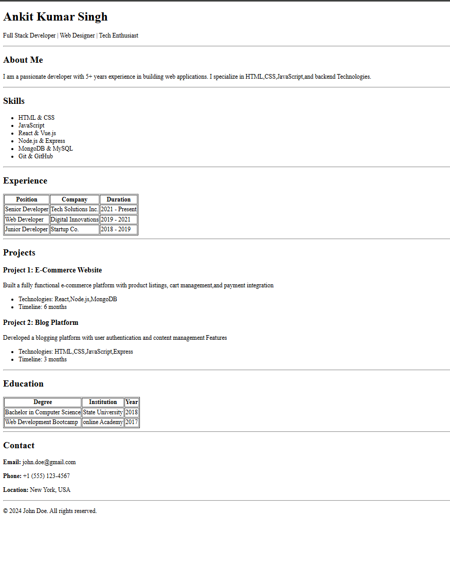

# Semantic HTML Resume Project

A simple and beginner-friendly resume project built using **pure HTML5 semantic tags**.  
This project focuses on clean structure, proper semantics, and accessibility — without using CSS or JavaScript.

---

## 🌐 Live Demo

You can view the live hosted resume here:  
🔗 **https://html-resume-page-assignment.netlify.app/**

---

## 👀 Preview

Below is a preview of the resume layout:



---

## 📌 Project Description

This project demonstrates how to create a resume using only semantic HTML5 elements.  
It helps beginners understand proper document structure, readability, and accessibility best practices.

---

## 🎯 Key Highlights

- Built using **HTML5 semantic elements only**
- Proper heading hierarchy (`h1 → h2 → h3`)
- Clean and readable markup
- Accessibility-friendly structure
- Beginner-focused project

---

## 📚 What I Learned

### 1. Semantic HTML5 Tags

- `<header>` – Name and professional title  
- `<main>` – Main resume content  
- `<section>` – Logical grouping of content  
- `<article>` – Individual projects or experience entries  
- `<table>`, `<thead>`, `<tbody>` – Structured data (education & experience)  
- `<address>` – Contact information  
- `<footer>` – Footer and copyright  
- `<hr>` – Visual separation between sections  

### 2. HTML Structure
How to organize content logically using proper document flow and semantic elements.

### 3. Accessibility
How semantic HTML improves screen reader support and overall accessibility.

### 4. Best Practices
Writing clean, readable HTML without inline styles or unnecessary tags.

---

## 🛠️ Project Implementation Steps

### Step 1: Basic Setup
- Created `index.html`
- Added HTML5 boilerplate (`<!DOCTYPE html>`)
- Included meta tags for charset and viewport

### Step 2: Semantic Layout
- Used `<header>` for name and role
- Wrapped content inside `<main>`
- Organized resume into `<section>` elements:
  - About
  - Skills
  - Experience
  - Projects
  - Education
  - Contact

### Step 3: Content
- Added meaningful text content
- Used lists and tables where appropriate
- Applied `<hr>` for section separation

### Step 4: Footer
- Added `<footer>` with copyright information

---

## ▶️ How to Run Locally

### Method 1: Open in Browser
1. Navigate to the project folder
2. Open `index.html` in any web browser

### Method 2: Using VS Code Live Server
1. Install **Live Server** extension
2. Right-click on `index.html`
3. Select **Open with Live Server**

---

## 🚀 How to Push to GitHub

```bash
git init
git add .
git commit -m "Initial commit: semantic HTML resume project"
git branch -M main
git remote add origin <repository-url>
git push -u origin main
